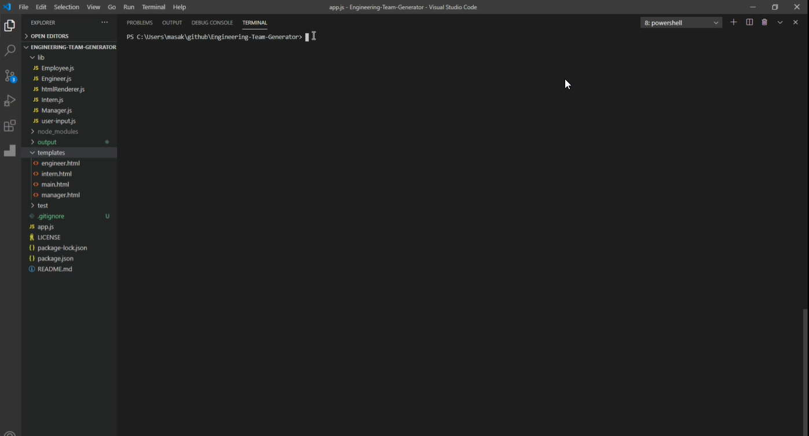
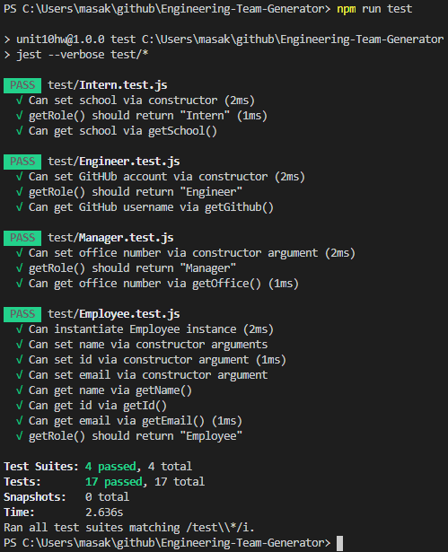

# Engineering-Team-Generator

## Description
A command-line application that takes in information about employees and generates an HTML webpage that displays summaries for each person

## Table of Contents
* [Installation](#Installation)
* [Usage](#Usage)
* [License](#License)
* [Contributing](#Contributing)
* [Tests](#Tests)
* [Questions](#Questions)

## Installation
1.	Make sure node.js is installed
2.	You can type the following code at terminal to check if node.js is installed
	>  node –-version
3.	If node version doesn’t show up, you can download it from https://nodejs.org/en/download/
4.	The following files are what you need to run the program
	- lib/
	- templates/
	- app.js
	- package.json
5.	Type the following code at terminal to install package
	>  npm install

## Usage
1.	Type the following code at terminal to run the CLI
	>  node app.js
2.	Select the role in the team to start with.
3.	Depending on the role chosen, the following questions will be prompted to be answered
	-	name
	-	id
	-	email
	-	office number
	-	github username
	-	school
4.	Once all the team-members inserted, select exit to exit the program and the webpage of engineer-team will be created

## Demo
Click on the pic to see the demo video

## License

## Contributing
Please submit a **Pull request** if you would like to contribute to the project

## Tests
Type the following code at terminal to run the test
>  npm run test

## Questions
* Follow me at: <a href="https://github.com/masakaede" target="_blank">https://github.com/masakaede</a>

* Please email to pichengchang@gmail.com if you have any question

© 2020 masakaede